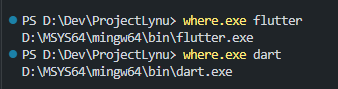

# 🎯 mingw64-dart (Community Edition)

[](LICENSE)
[](https://github.com/Bloby22/mingw64_dart/releases)
[](https://github.com/Bloby22/mingw64_dart/actions/workflows/build.yml)

Dart SDK packaged for **MSYS2 MinGW64**, with native `dart.exe` launcher.

---

## ⚡ Quick Install

Download the latest `.pkg.tar.zst` from the [Releases page](https://github.com/Bloby22/mingw64_dart/releases) and install it in an **MSYS2 MINGW64** terminal:

```bash
pacman -U mingw-w64-x86_64-dart-<version>-1-any.pkg.tar.zst
```

Verify:

```bash
dart --version
flutter --version
```

> The first `flutter` run builds the Flutter tool, which takes a moment.

---

## 📦 What's Included

- Dart SDK 3.13.5
- Native launchers (`dart.exe`, `flutter.exe`) that work inside MSYS2 bash
- MINGW64 only (UCRT64 and CLANG64 are not supported)

Versions are updated automatically: a daily GitHub Actions workflow opens a pull request with the latest releases and official SHA256 checksums, and CI builds and tests the package before it is merged.

---

## 📝 Examples



---

## 🏗️ Build From Source

In an MSYS2 MINGW64 terminal:

```bash
pacman -S --needed git base-devel mingw-w64-x86_64-gcc
git clone https://github.com/Bloby22/mingw64_dart.git
cd mingw64_dart
makepkg -si
```

The build downloads about 2 GB (mostly Flutter), so it takes a while.

---

## 📄 License

- **This project**: MIT License
- **Dart SDK**: BSD License (Google)
- **Flutter SDK**: BSD License (Google)

---

## ⚠️ Disclaimer

This project is not affiliated with Google or MSYS2.

Community-maintained package for Windows developers.

---

**Made with ❤️ for the MSYS2 community**
